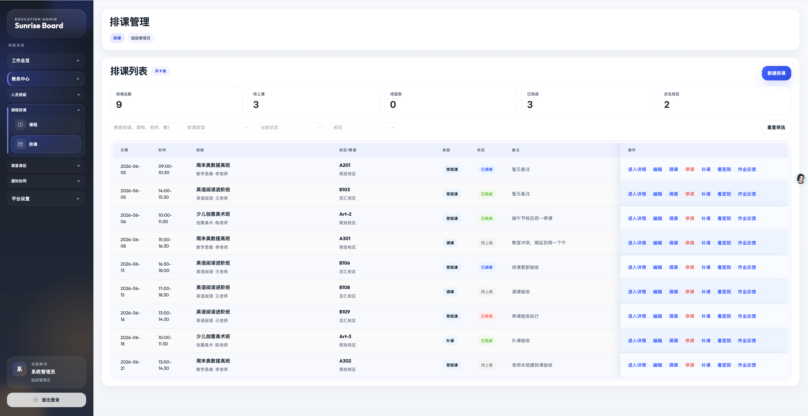
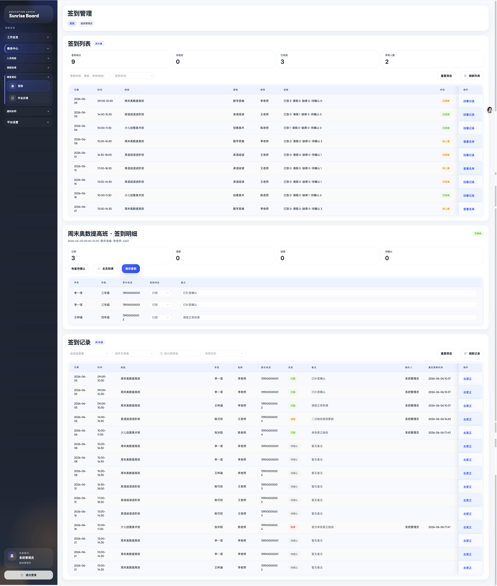
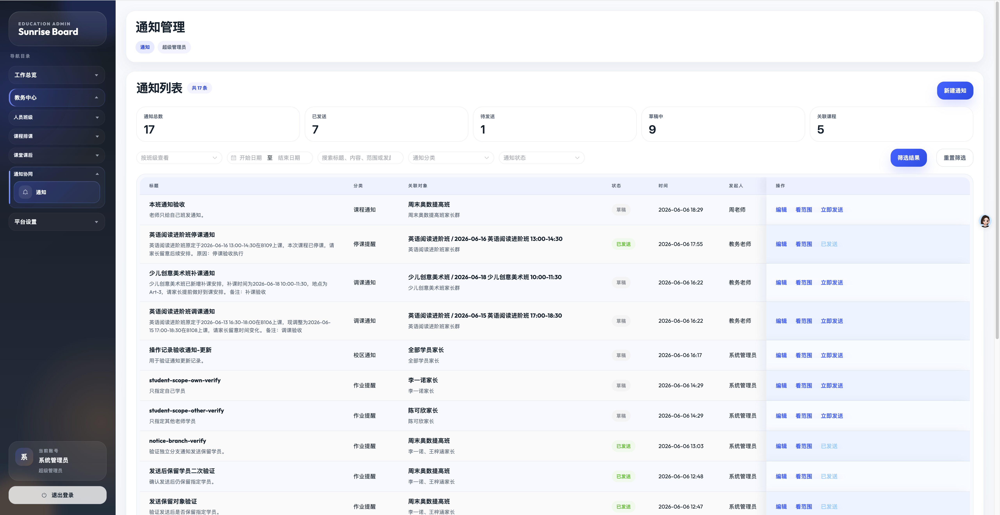

# Edu Admin

一个面向中小培训机构的轻量运营后台，专注把学员、班级、排课、签到、作业反馈和通知这条日常流程做顺。

## 1 分钟看懂

`Edu Admin` 不是通用后台模板，而是一套更贴近培训机构日常运营的业务后台起步方案。

它优先覆盖这些高频场景：

- 教务录入学员、维护家长联系方式，并把学员加入班级
- 负责人查看今日课程、签到情况、学员和班级规模
- 教务安排课程，处理调课、停课、补课
- 老师完成签到，发布作业，填写课后反馈
- 教务或负责人发送通知，并回看通知历史和影响范围

首版目标是先让一个中小机构可以顺畅跑完“学员 -> 班级 -> 排课 -> 签到 -> 作业反馈 -> 通知”的基础闭环。

## 当前状态

当前版本已经可以直接演示：

- 登录、账号、角色和权限
- 首页总览
- 老师、学员、课程、班级管理
- 排课、调课、停课、补课
- 签到和签到记录回看
- 作业发布和课后反馈
- 通知创建、发送、历史和影响范围
- 操作记录
- 本地 MySQL 自动建库、建表和演示数据初始化

还在继续完善的方向：

- 老师账号只看自己相关班级和任务
- 排课日历视图
- 学员按班级筛选
- 作业按学员记录提交状态
- 通知按接收对象记录阅读或送达状态

## 演示截图

下面截图来自当前演示环境，覆盖排课、签到和通知这几条主要路径。

### 排课管理



### 签到管理



### 通知管理



## 默认账号和角色

首次启动并连接数据库后，系统会自动写入默认角色、账号和一批演示数据。

| 账号 | 密码 | 角色 | 适合体验 |
| --- | --- | --- | --- |
| `admin` | `123456` | 超级管理员 | 查看全部功能、账号角色和操作记录 |
| `boss` | `123456` | 机构负责人 | 查看全局业务情况 |
| `staff` | `123456` | 教务/前台 | 维护学员、班级、排课、签到和通知 |
| `teacher` | `123456` | 老师 | 体验签到、作业反馈和通知查看 |

说明：老师角色目前已经有菜单权限区分，但数据范围还在继续收紧，后续会让老师默认只看到自己相关的班级和课程任务。

## 推荐体验路径

启动项目后，可以按下面这条线体验首版闭环：

1. 用 `admin / 123456` 登录后台。
2. 进入首页，看今日课程、待签到、近期课表和最近通知。
3. 进入学员页，查看学员资料和家长联系方式。
4. 进入班级详情，查看班级学员、近期排课、签到、作业和通知。
5. 进入排课页，新建一节课，或对已有课程执行调课、停课、补课。
6. 进入签到页，对一节课完成签到，并回看签到记录。
7. 进入作业反馈页，给一次课程发布作业并填写课后反馈。
8. 进入通知页，创建通知、发送通知，并查看通知影响范围。
9. 进入操作记录页，查看关键操作是谁在什么时候完成的。

## 本地启动

### 环境要求

- Go 1.22+
- Node.js 20+
- MySQL 8
- npm

### 1. 准备配置

```bash
git clone https://github.com/jiachang666/edu-admin.git
cd edu-admin
cp .env.example .env
```

`.env.example` 默认连接：

- 地址：`127.0.0.1`
- 端口：`3307`
- 账号：`root`
- 密码：`123456`
- 数据库：`edu-admin`

如果你的 MySQL 不是这组配置，直接改 `.env` 里的 `MYSQL_HOST`、`MYSQL_PORT`、`MYSQL_USER`、`MYSQL_PASSWORD` 和 `MYSQL_DATABASE`。

### 2. 启动后端

```bash
go run ./cmd/server
```

也可以使用：

```bash
make run
```

默认后端地址：

- `http://localhost:8080`

健康检查：

```bash
curl http://localhost:8080/healthz
```

首次启动时，系统会自动创建数据库、创建数据表，并写入默认账号、角色和演示数据。

### 3. 启动前端

```bash
cd web/admin
npm install
npm run dev
```

也可以在仓库根目录使用：

```bash
make web-dev
```

默认前端地址：

- `http://localhost:5173`

前端开发服务会把 `/api` 请求转发到 `http://localhost:8080`。如果你的后端地址不同，可以在 `web/admin` 下增加本地环境变量：

```bash
VITE_API_PROXY_TARGET=http://localhost:8080
VITE_PORT=5173
```

## 使用 Docker 启动 MySQL

仓库提供了 `docker-compose.yml`，可以用来快速启动 MySQL 和 Redis：

```bash
docker compose up -d mysql redis
```

当前 `docker-compose.yml` 默认 MySQL 配置是：

- 地址：`127.0.0.1`
- 端口：`3306`
- 账号：`root`
- 密码：`root`
- 数据库：`edu_admin`

如果使用这套 Docker 配置，请把 `.env` 改成：

```bash
MYSQL_HOST=127.0.0.1
MYSQL_PORT=3306
MYSQL_USER=root
MYSQL_PASSWORD=root
MYSQL_DATABASE=edu_admin
```

然后再启动后端：

```bash
go run ./cmd/server
```

## 简单部署说明

### 后端

```bash
go build -o bin/edu-admin ./cmd/server
APP_ENV=production HTTP_ADDR=:8080 ./bin/edu-admin
```

部署时需要准备 MySQL 8，并通过环境变量提供数据库连接信息：

```bash
MYSQL_HOST=127.0.0.1
MYSQL_PORT=3306
MYSQL_USER=root
MYSQL_PASSWORD=your-password
MYSQL_DATABASE=edu_admin
MYSQL_AUTO_SEED=true
```

如果不希望线上环境自动写入演示数据，可以设置：

```bash
MYSQL_AUTO_SEED=false
```

### 前端

```bash
cd web/admin
npm install
npm run build
```

构建结果在 `web/admin/dist`。可以用 Nginx 或其他静态文件服务托管，并把 `/api` 请求反向代理到后端服务。

一个最小 Nginx 方向如下：

```nginx
server {
  listen 80;
  server_name your-domain.com;

  root /path/to/edu-admin/web/admin/dist;
  index index.html;

  location / {
    try_files $uri $uri/ /index.html;
  }

  location /api/ {
    proxy_pass http://127.0.0.1:8080/api/;
  }
}
```

## 常用命令

```bash
# 启动后端
make run

# 后端检查
make test

# 整理 Go 依赖
make tidy

# 启动前端
make web-dev

# 前端构建
cd web/admin && npm run build
```

## 技术方案

后端：

- Go
- Gin
- GORM
- MySQL 8

前端：

- Vue 3
- TypeScript
- Vite
- Vue Router
- Pinia
- Element Plus

项目形态：

- 单体仓库
- 后台前后端分离
- 以业务模块组织代码

## 目录结构

```text
edu-admin
├── cmd/server               # 后端启动入口
├── internal/app             # 启动、配置、路由、中间件
├── internal/modules         # 业务模块
├── internal/platform        # 数据库、日志、权限等基础能力
├── web/admin                # 前端后台工程
├── assets/readme            # README 演示截图
├── scripts                  # 本地开发辅助脚本
└── README.md
```

## 适合谁参考

- 准备做培训机构后台的团队
- 准备做学校教务后台的团队
- 想参考垂直行业后台结构的开发者
- 想从真实业务闭环出发搭建 SaaS 后台的人

## 协作开发

- 分支、提交和合并约定见 [CONTRIBUTING.md](CONTRIBUTING.md)
- 本地规划文档放在 `docs/`
- 对外说明优先更新仓库根目录文档
